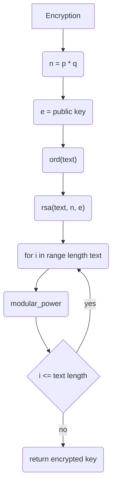
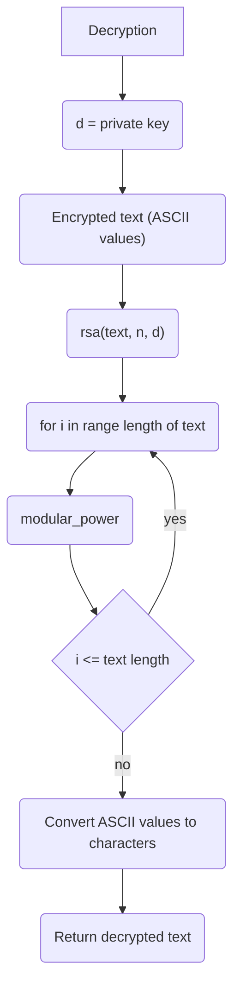

# TIN_SLE_PFI
Projektarbeit Nr. 2 RSA

## Backlog:
Planned Implementations:
1. Key generation
2. Encryption
3. Decrypyion

## Flowchart

## Sources
All work was evaluated and implemented with the help of the articles mentioned below

### Flowchart
- Mermaid.js - https://mermaid.js.org/intro/getting-started.html

### RSA
- RSA MIT Paper - https://people.csail.mit.edu/rivest/Rsapaper.pdf
- RSA tutorial - https://studyflix.de/informatik/rsa-verschlusselung-1608

### Benchmark and Diagram
- matplotlib - https://matplotlib.org/stable/users/index
- pytest-benchmark - https://pytest-benchmark.readthedocs.io/en/latest/
- Big O Complexity - https://web.mit.edu/16.070/www/lecture/big_o.pdf

### Python
- Hello World - https://www.learnpython.org/en/Hello%2C_World!
- Variables and Types - https://www.learnpython.org/en/Variables_and_Types
- Lists - https://www.learnpython.org/en/Lists
- Basic Operators - https://www.learnpython.org/en/Basic_Operators
- Conditions - https://www.learnpython.org/en/Conditions
- Loops - https://www.learnpython.org/en/Loops
- Functions - https://www.learnpython.org/en/Functions

### Git
- Git - https://git-scm.com/docs
- Commits - https://www.conventionalcommits.org/en/v1.0.0/
- Git Actions https://docs.github.com/en/actions

### Markdown
- Md doc - https://docs.github.com/en/get-started/writing-on-github/getting-started-with-writing-and-formatting-on-github/basic-writing-and-formatting-syntax