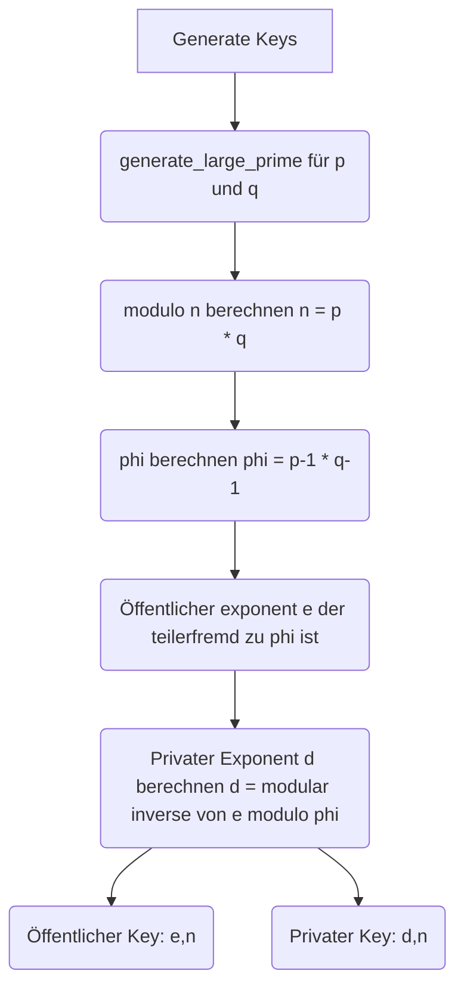

# TIN_SLE_PFI
Projektarbeit Nr. 2 RSA
## Flowchart

```mermaid

flowchart TD
    A[Generate Keys] -->C(generate_large_prime für p und q)
    C-->D(modulo n berechnen n = p * q)
    D-->F(phi berechnen phi = p-1 * q-1)
    F-->G(Öffentlicher exponent e der teilerfremd zu phi ist)
    G-->H(Privater Exponent d berechnen d = modular inverse von e modulo phi)
    H-->I(Öffentlicher Key: e,n)
    H-->J(Privater Key: d,n)
```