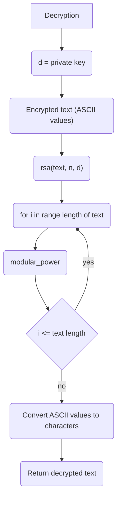

```mermaid
flowchart TD
    A[Decryption] -->B(d = private key)
    B-->C("Encrypted text (ASCII values)")
    C-->D("rsa(text, n, d)")
    D-->E(for i in range length of text)
    E-->F(modular_power)
    F-->G{i <= text length}
    G-->|yes|E
    G-->|no|H(Convert ASCII values to characters)
    H-->I("Return decrypted text")
```