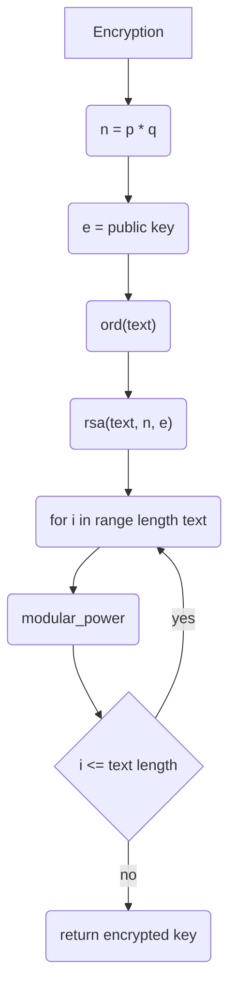

```mermaid
flowchart TD
    A[Encryption] -->C(n = p * q)
    C-->D(e = public key)
    D-->E("ord(text)")
    E-->F("rsa(text, n, e)")
    F-->G(for i in range length text)
    G-->H(modular_power)
    H-->I{i <= text length}
    I-->|yes|G
    I-->|no|J(return encrypted key)
```